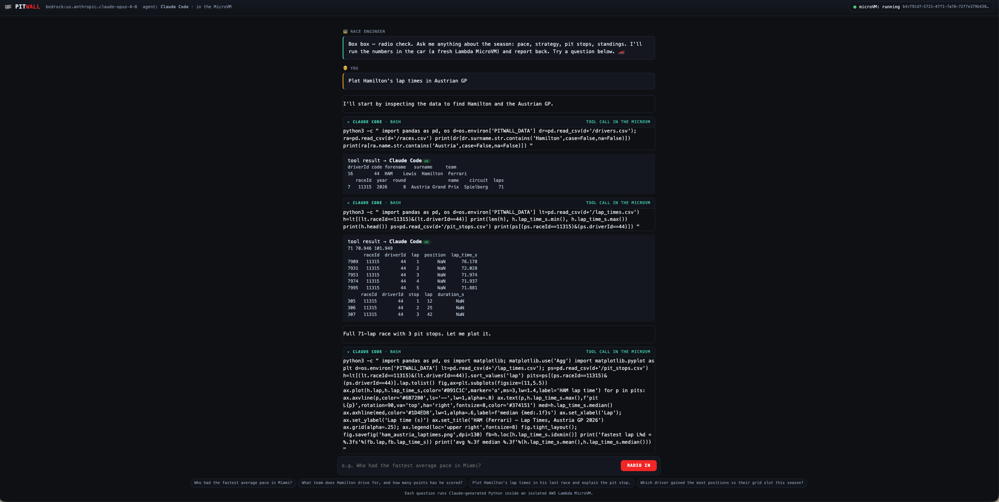
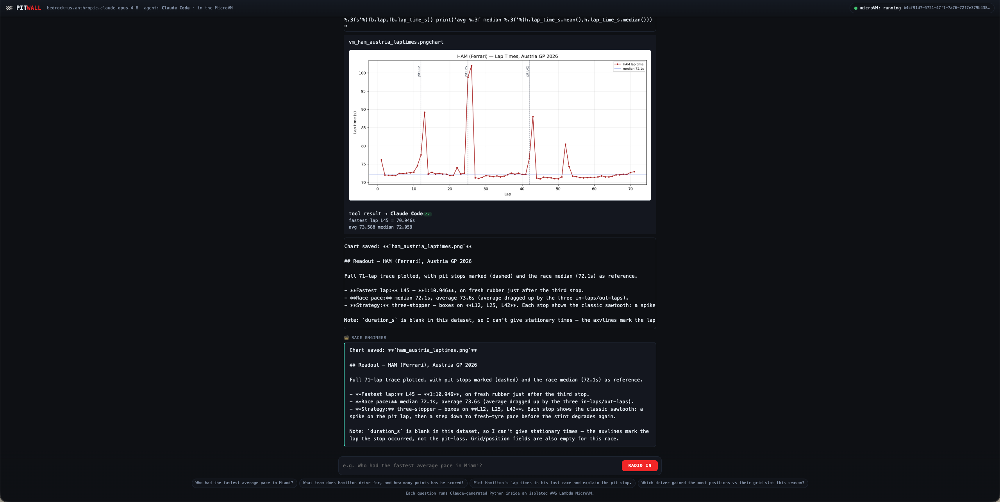

# 🏁 Pitwall

A conversational F1 race-engineer data lab. Ask a question in plain English.
Pitwall spins up an AWS Lambda MicroVM, and inside that VM the Claude Code
CLI (pointed at Amazon Bedrock) writes some pandas/matplotlib, runs it over
open F1 data, and streams the answer back to you with charts.

The host process is a thin proxy. It launches the VM, forwards your question,
and renders the tool trace. It doesn't hold any LLM keys and doesn't execute
any user code.

```
You: Who had the fastest average pace in Miami?

  ┌─ Write /opt/pitwall/pace.py
  │ import os, pandas as pd
  │ d = os.environ['PITWALL_DATA']
  │ ...
  └────────────────────────────
  ┌─ Bash: python3 /opt/pitwall/pace.py
  └────────────────────────────
  result [ok]
  │  driverId   mean  count code      team
  │         3 97.456     55  VER  Red Bull Racing

Pitwall: ANT (Mercedes) had the fastest average pace in Miami, edging NOR
(McLaren) by about 0.045s/lap on clean green-flag laps...
```

The dataset is real current-season F1 data (Hamilton is at Ferrari, Audi and
Cadillac are on the 2026 grid). What's in it depends on which races have
finished when you build the image. See [Data](#data).

## Why this design

A chatbot that just looks things up doesn't need a sandbox. That's a plain
tool call. Pitwall has Claude write and run analysis code instead. This:

- keeps answers grounded in computation over the data instead of memory,
- produces real charts and tables the model can iterate on,
- gives you an actual reason to isolate code execution, which is what
  Lambda MicroVMs are for.

The twist here vs. the usual "host-side agent, VM-side runner" split: the
whole coding agent (the Claude Code CLI) runs inside the MicroVM. The VM
authenticates to Bedrock through its own execution role, writes and runs
Python locally, and streams the tool trace out over its HTTPS endpoint. So
the isolation boundary contains both the model's decisions and its actions.

## Prerequisites

- Python 3.9+ and git.
- An AWS account with the `lambda-microvms` API, and credentials configured
  (`aws configure`, `AWS_PROFILE`, or `AWS_ACCESS_KEY_ID`/`AWS_SECRET_ACCESS_KEY`
  env vars). The identity needs `lambda-microvms:*`, plus permission to create
  an S3 bucket and an IAM role.
- A current AWS CLI (≥ 2.35.11) or a boto3 that includes `lambda-microvms`.
  Pitwall uses whichever it finds.
- A supported region: `us-east-1`, `us-east-2`, `us-west-2`, `ap-northeast-1`,
  or `eu-west-1`. Set `AWS_REGION` to one of these.
- Bedrock access with a Claude model enabled in your region. The Claude Code
  CLI inside the VM calls Bedrock through the VM's execution role, which
  `setup_aws.sh` creates for you. No keys on the host. See
  [First time on AWS or Bedrock?](#first-time-on-aws-or-bedrock) if this is new.

## First time on AWS or Bedrock?

Skip to [Quickstart](#quickstart) if you already have AWS credentials and
Bedrock model access. Otherwise, three one-time steps:

1. Get AWS credentials. If you don't have an IAM user or role with access
   keys, follow AWS's
   [getting started with IAM guide](https://docs.aws.amazon.com/IAM/latest/UserGuide/getting-started.html)
   and run `aws configure`.

2. Enable the Claude model in Bedrock. Model access isn't on by default:
   - Open the [Bedrock console](https://console.aws.amazon.com/bedrock/) in
     a supported region.
   - Go to Bedrock configurations > Model access > Modify model access.
   - Pick the Claude model you want (e.g. Claude Opus) and submit. Anthropic
     models on Bedrock are usually approved instantly.
   - If you get stuck, see AWS's
     [walkthrough](https://repost.aws/knowledge-center/bedrock-access-anthropic-model).

3. Grant the IAM permissions Pitwall needs. The identity you run Pitwall as
   drives Lambda MicroVMs, S3, and IAM to build and launch the image. It
   does not need `bedrock:InvokeModel` itself; that lives on the MicroVM's
   execution role, which `setup_aws.sh` creates. Minimal policy for the host
   identity:

   ```json
   {
     "Version": "2012-10-17",
     "Statement": [
       {
         "Sid": "LambdaMicroVMs",
         "Effect": "Allow",
         "Action": "lambda-microvms:*",
         "Resource": "*"
       },
       {
         "Sid": "BuildInfra",
         "Effect": "Allow",
         "Action": [
           "s3:CreateBucket", "s3:PutObject", "s3:GetObject",
           "s3:HeadBucket", "s3:PutBucketPublicAccessBlock",
           "iam:CreateRole", "iam:GetRole",
           "iam:PutRolePolicy", "iam:UpdateAssumeRolePolicy",
           "sts:GetCallerIdentity"
         ],
         "Resource": "*"
       }
     ]
   }
   ```

   Broad on purpose to get you moving. Tighten the resource ARNs before you
   use this in a shared or production account.

## Quickstart

Pitwall runs analysis inside a MicroVM, so there's a one-time build step. It
creates any AWS resources it needs if they're missing (S3 bucket, IAM roles),
and Pitwall finds the built image by name at runtime, so there are no ARNs
to copy around.

```bash
git clone <your-fork-url> pitwall && cd pitwall
python3 -m venv .venv && .venv/bin/python -m pip install -e .
export AWS_REGION=us-west-2          # your region (or set it in .env)

./microvm_image/build_image.sh      # ~3-5 min
.venv/bin/pitwall                                  # interactive REPL
.venv/bin/pitwall "Who had the fastest average pace in Miami?"   # one-shot
```

You don't need a `.env` if `AWS_REGION` and credentials are already in your
environment. `.env` is just for convenience; copy `.env.example` to `.env` if
you want it. Never commit `.env` (it's git-ignored).

The first `build_image.sh` fetches real F1 data from OpenF1 (free, rate
limited). If OpenF1 is throttling, the build falls back to a bundled
synthetic dataset so it still completes. See [Data](#data).

> Rebuilding weeks later? The build caches CSVs in `microvm_image/data/` so
> you don't hit OpenF1 on every Dockerfile tweak. If you want new races,
> force a re-fetch:
>
> ```bash
> PITWALL_REBUILD_DATA=1 ./microvm_image/build_image.sh
> # or nuke the cache directly:
> rm -rf microvm_image/data && ./microvm_image/build_image.sh
> ```
>
> The build prints a provenance line at the top (e.g. `Races included: 10`)
> so you can see what actually went in.

## Web UI 🏎️

There's a pit-wall styled web UI that renders charts inline and shows live
MicroVM status (launching, running, endpoint). Same MicroVM image as the CLI.

```bash
.venv/bin/python -m pip install -e ".[web]"   # adds fastapi + uvicorn
.venv/bin/pitwall-web                          # http://127.0.0.1:8000
```

Ask a question in the browser. The Python appears as it runs in the VM,
charts render inline, and the engineer radios back the readout. The server
launches one MicroVM on the first question and terminates it on shutdown
(Ctrl-C). Set `PITWALL_WEB_HOST` / `PITWALL_WEB_PORT` to change the bind
address.

### What it looks like

*"Plot Hamilton's lap times in Austrian GP"*. The header shows the model,
the `agent: Claude Code · in the MicroVM` chip, and live MicroVM state.
Each tool call is tagged `Claude Code · Bash` or `Claude Code · Write`, so
you can see the coding agent (not the host) running each step inside the
sandbox:



Charts stream back inline as the VM produces them, followed by the readout:



## Things to ask

The dataset covers whichever races have run this season, so these always work:

- "What team does Hamilton drive for, and how many points has he scored?"
- "Who's leading the drivers' championship, and by how much?"
- "Who had the fastest average pace in the most recent race?"
- "Compare Hamilton's and Leclerc's race pace at Ferrari this season."
- "Plot Hamilton's lap times in his last race and explain the pit stop."
- "Who gained the most positions relative to their grid slot this season?"

## Configuration

| Variable / flag       | Default            | Purpose |
|-----------------------|--------------------|---------|
| `PITWALL_MODEL` / `--model`      | `us.anthropic.claude-opus-4-8` | Bedrock inference-profile id used by Claude Code inside the VM. Forwarded per-request, so no rebuild needed to swap. |
| `PITWALL_MICROVM_IMAGE_NAME`     | `pitwall-lab`       | Image looked up by name at runtime. |
| `PITWALL_MICROVM_IMAGE_ARN`      | -                   | Optional: pin an exact image ARN instead of a name lookup. |
| `PITWALL_MICROVM_EXEC_ROLE_ARN`  | *auto*              | Optional: pin the exec role ARN. Auto-derived from your account as `PitwallMicrovmExecRole`. |
| `AWS_REGION`                     | -                   | Required (lambda-microvms + the Bedrock endpoint the VM calls). |
| `--hide-code`                    | off                 | Print only results, not the generated code (CLI). |
| `PITWALL_WEB_HOST` / `PITWALL_WEB_PORT` | `127.0.0.1` / `8000` | Bind address for `pitwall-web`. |

All variables can live in a `.env` (auto-loaded). The full set of MicroVM
variables (`PITWALL_MICROVM_*`, build settings) is in
[`.env.example`](.env.example) and the
[Setup](#setup-from-zero-to-a-running-microvm) section.

> Bedrock is called from inside the MicroVM via the exec role
> (`bedrock:InvokeModel*` on `anthropic.*` foundation models and inference
> profiles). Nothing on the host talks to an LLM.

## Data

By default Pitwall uses real current-season F1 data from
[OpenF1](https://openf1.org), a free key-less API of actual timing data.
The fetch (`pitwall/fetch_openf1.py`) runs once at image-build time on your
machine and bakes the CSVs into the MicroVM image, so every session has the
data locally with no runtime network call. Re-run the build to refresh
(it picks up whatever races have completed).

Two sources, selected by `PITWALL_DATA_SOURCE`:

| `PITWALL_DATA_SOURCE` | What you get |
|---|---|
| `openf1` (default) | Real current-season data fetched from OpenF1. Needs network at build time. |
| `synthetic` | Deterministic simulated data (real 2023 grid, fixed-seed timing). Offline; useful as a fallback for building with no network. |

To use your own data, drop CSVs with this schema into `microvm_image/data/`
before building: `drivers.csv`, `races.csv`, `results.csv`, `pit_stops.csv`,
`lap_times.csv`. See `pitwall/data.py` for details. With real data, `driverId`
is the car number (join to `drivers.csv` on `driverId` to get the 3-letter
code and team). `grid` and per-lap `position` may be blank where OpenF1
doesn't provide them.

> Attribution: race data from [OpenF1](https://openf1.org) (CC BY 4.0).
> Pitwall is not affiliated with OpenF1, Formula 1, or the FIA. "F1" and
> related marks belong to their owners. For analysis and education only.

## Architecture

```
 CLI / web  ── question ──▶  MicroVMSandbox  ── POST /ask ──▶  MicroVM (per session)
     │                          host proxy                       │
     │                       (no LLM here)                       │  claude -p ...
     │                                                           │  (Bedrock via exec role)
     │                                                           ├─ Write hello.py
     │                                                           ├─ Bash: python3 hello.py
     │                                                           └─ collects artifacts
     │                                                           │
     └── text | tool_use | tool_result | artifact | answer ◀─ NDJSON stream ─┘
```

- `microvm_image/`: what runs inside the VM. `server.py` accepts `/ask`,
  spawns `claude -p`, normalizes its `stream-json` events, and streams NDJSON
  back. `Dockerfile` installs the Claude Code CLI, pandas/matplotlib, and a
  non-root user. `setup_aws.sh` / `build_image.sh` handle the AWS side.
- `pitwall/sandbox.py`: `Sandbox` interface and `AskResult` type.
- `pitwall/microvm.py`: `MicroVMSandbox`. Launches the VM, POSTs to `/ask`,
  streams events back into user-supplied callbacks. Dual boto3/CLI drivers.
- `pitwall/agent.py`: a thin host-side proxy. Forwards question and system
  prompt into the sandbox and fans events out to the CLI/web renderers. No
  host-side model client, no host-side tool loop.
- `pitwall/config.py`: env-var / `.env` configuration. Auto-derives the
  MicroVM exec role ARN from your account and region.
- `pitwall/data.py`: dataset source dispatch and schema (used at build time).
- `pitwall/fetch_openf1.py`: real-data fetcher (OpenF1 to CSVs).
- `pitwall/cli.py`: REPL and one-shot front door.
- `pitwall/web.py` + `pitwall/static/`: the pit-wall web UI (FastAPI + SSE
  backend, single-page frontend). Additive front-end over the same `Agent`.

## How the MicroVM sandbox works

Each session runs in its own
[AWS Lambda MicroVM](https://docs.aws.amazon.com/lambda/latest/dg/lambda-microvms-guide.html).
Pitwall uses the feature directly:

| MicroVM capability | How Pitwall uses it |
|---|---|
| VM-level isolation | The whole coding agent (Claude Code and everything it Bash/Write's) runs in a real Firecracker VM, not your host. Even the Bedrock call originates inside the VM. |
| Snapshot fast-boot | Image pre-baked with the Claude Code CLI, python, pandas, and the dataset. Sessions launch from a snapshot in ~5s. |
| Suspend / resume | An idle policy suspends the VM while you think and auto-resumes on the next question. Idle sessions stop being billed for compute. |
| Dedicated HTTPS endpoint | Questions POST to the VM's own endpoint (with `X-aws-proxy-auth`). The VM streams events (NDJSON) back on the same connection. No load balancer, no connection table. |
| Execution role | Lambda MicroVMs vends temporary AWS creds to the running VM. The in-VM Claude Code CLI calls Bedrock as `PitwallMicrovmExecRole`. No static keys ever enter the sandbox. |

### Setup: from zero to a running microVM

You need an AWS account with a current AWS CLI or boto3, and credentials
configured (`aws configure` or env vars).

```bash
# 1. Install + region.
python3 -m venv .venv && .venv/bin/python -m pip install -e .
export AWS_REGION=us-west-2          # or your region (or put it in .env)

# 2. Build the image. This one command auto-creates the S3 bucket and IAM
#    roles if they don't exist, builds the dataset, runs the Dockerfile on
#    AWS, snapshots the result, and polls until ready. A few minutes.
./microvm_image/build_image.sh

# 3. Run. Pitwall finds the image by name automatically.
pitwall "Plot Hamilton's pace in his last race and explain the stop."
```

That's the whole flow. `build_image.sh` calls `setup_aws.sh` for you when
needed; you only run `setup_aws.sh` directly if you want to pre-create the
infra separately. To refresh the data later, run
`PITWALL_REBUILD_DATA=1 ./microvm_image/build_image.sh`. It re-fetches OpenF1
and updates the existing image in place. Without that env var, the build
reuses the cached CSVs in `microvm_image/data/`.

What gets created (and how to remove it later):

| Resource | Name (default) | Why | Tear down |
|---|---|---|---|
| S3 bucket | `pitwall-microvm-<account>-<region>` | Stages the build zip | `aws s3 rb s3://<bucket> --force` |
| IAM build role | `PitwallMicrovmBuildRole` | Lambda assumes it while building the image | `aws iam delete-role-policy … && aws iam delete-role …` |
| IAM exec role | `PitwallMicrovmExecRole` | Vended to the running MicroVM so Claude Code inside can call Bedrock | `aws iam delete-role-policy … && aws iam delete-role …` |
| MicroVM image | `pitwall-lab` | The snapshot sessions launch from | `aws lambda-microvms delete-microvm-image --image-identifier <arn>` |

What happens per session: `run-microvm` launches a VM from the snapshot
(with `--execution-role-arn` pointing at `PitwallMicrovmExecRole`), poll
`get-microvm` until `RUNNING`, `create-microvm-auth-token` mints a scoped
token, each question POSTs to `https://<endpoint>/ask` with the
`X-aws-proxy-auth` header, the in-VM server spawns `claude -p` (which
authenticates to Bedrock via the exec role, writes Python, and runs it with
Bash), events stream back as NDJSON, the idle policy suspends and resumes
the VM around your thinking time, and `terminate-microvm` runs on exit.

The in-VM app lives in [`microvm_image/`](microvm_image/): `server.py` is
a stdlib HTTP server exposing `/ask` and the MicroVM lifecycle hooks
(including `/ready`), `Dockerfile` builds on Lambda's snapshot-compatible
AL2023 base image and adds the Claude Code CLI, a non-root user, and the
Bedrock env, and the baked dataset ships alongside.

> 💰 Cost: running microVMs are billed per second of compute. Suspended ones
> only pay for snapshot storage. Terminated ones cost nothing. Pitwall
> terminates the VM on exit and the idle policy auto-suspends while you
> think. Delete the image when you're done (see the table above) to stop
> storage charges.

## License

[MIT](LICENSE). Contributions welcome.
